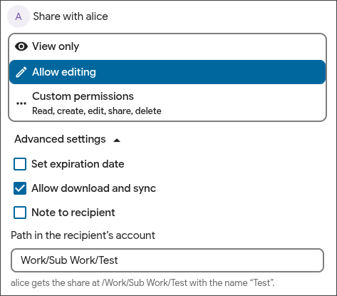

<h1 align="center">Share Target</h1>

<p align="center">
  <a href="https://github.com/amsys/files_set_target/actions/workflows/phpunit.yml"></a>
  <a href="https://github.com/amsys/files_set_target/actions/workflows/lint-php.yml"></a>
  <a href="https://github.com/amsys/files_set_target/actions/workflows/lint-eslint.yml"></a>
  <a href="https://sonarcloud.io/summary/new_code?id=amsys_files_set_target"></a>
  <a href="LICENSE"></a>
  
  
</p>

Share Target lets the sharer choose where a share lands in the files of the
recipient. Nextcloud puts every incoming share in the share folder, under
the name of the file. This app adds one field to the sharing sidebar and
puts the share at the path you enter instead.

Share a folder `Docs` to `Work/Client Files`, and the recipient finds
`Client Files` inside `Work`.

<p align="center">
  
</p>

## Features

- One field in the Sharing tab of the sidebar, under **Advanced settings**.
- Works for account shares and for group shares.
- The browser refuses a bad path while you type. The server checks the same
  rules again and is the only authority.
- The app can make a missing parent folder, and remove it again when the
  share goes and the folder is empty. Both switches are off by default.
- An administrator decides who may use the field. Nobody can until the
  administrator says so.
- The recipient of an account share gets a notification that names the path.

## Install

Nextcloud 34, PHP 8.2 or later.

```sh
cd /path/to/nextcloud/apps
git clone https://github.com/amsys/files_set_target.git files_set_target
cd files_set_target
composer install --no-dev --optimize-autoloader
npm ci && npm run build
php /path/to/nextcloud/occ app:enable files_set_target
```

Then open **Administration → Share Target** and choose who may set a
target. The field shows for nobody until you do.

## Documentation

- [User guide](docs/USER-GUIDE.md): administration, use, group shares,
  troubleshooting.
- [Developer guide](docs/DEVELOPER-GUIDE.md): build, checks, how it
  works, release.

## License

AGPL-3.0-or-later. See [`LICENSE`](LICENSE).
